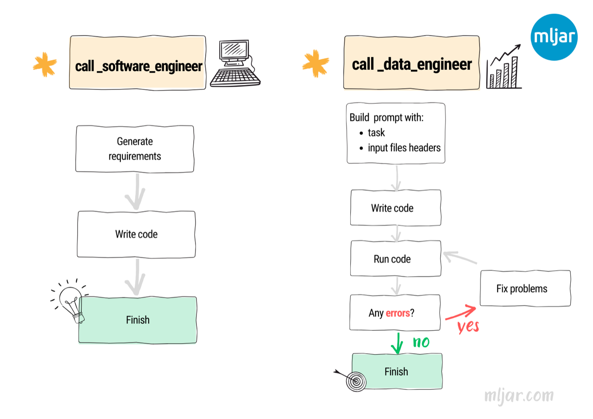

# MLJAR Agent

This repository is a fork of [AutoGPT](https://github.com/Significant-Gravitas/AutoGPT). It contains the submission for hackathon `AutoGPT Arena Hacks` hosted on [lablab.ai](https://lablab.ai/event/autogpt-arena-hacks).

The MLJAR Agent code is in the directory `autogpts/mljar-agent`.

## Agent Flow

The agent start with initial thoughts and requirements about task. It helps to keep details done in later steps.

The next step is a loop over set of functions:

- `web_search` - it is a mini-agent, it performs exhaustive web search using search engines (Google, Bing, DuckDuckGo), it reads websites and provides answer,
- `get_website` - it loads a website with `selenium` package and save HTML to file, and converts HTML to text and store in file (with `HTML2Text` package).
- `save_to_file` - saves string to a file,
- `execute_python` - executes a Python code,
- `call_software_engineer` - calls a Software Engineer mini-agent, 
- `call_data_engineer` - calls a Data Engineer mini-agent,
- `create_summary` - creates a summary of any text,
- `check_if_file_exists` - checks if files exists in the current directory,
- `all_done` - stops agent work and display the final response.

In each iteration we select the next function to perform. The agent is finishing the task after `all_done` called or reaching maximum iterations (currently hard-coded to 6).

## Web Search Agent

The `Web Search Agent` is doing web search to provide answer for query. It accepts two arguments:

- `query` - what we are looking for,
- `search_goal` - why we are looking for it. 

We use additional `search_goal` because we generate several varaitions of `query`. Based on generated `queries` we do a web search. We are using `Google Search`, `Bing`, `Duck Duck Go` to get links for websites. The next step is to read the content of the websites from search. We have used `selenium` package to load website. Thanks to this, we were able to load websites that are using JavaScript to dynamically load content. After HTML is downloaded from website we convert it to text (Markdown) with `HTML2Text` package. Each website's text is splitted into chunks. The split is done on H2 (`##` in Markdown) or H3 (`###` in Markdown) headers. All chunks are loaded to [Weaviate](https://weaviate.io/) vector database with OpenAI ebmeddings. We are using embedded version of Weaviate (running locally, without cloud), which acts as local memory for agent. We use `Weaviate` to return top 3 chunks that are the most similar to `query` and `search_goal`. Based on each chunk, agent provide response. The final response compress all previous responses. 

> **IMPORTANT** We tried not to use any external API. However, we get blocked by Google Search endpoint - each request got response HTTP 429 (too many requests). That's why we decided to use ScrapingBee service to make requests to Google Search. If your computer get blocked please set `SCRAPINGBEE_API_KEY`. 

### Additional tests

  
Which one has larger AUM Renaissance Technologies or Two Sigma?

  

  
Which one has more employees Renaissance Technologies or Two Sigma?

  

  
Write the country the inventor/creator of AutoGPT is from to a file called output.txt

  

## Data Engineer and Software Engineer Agents

## Results

